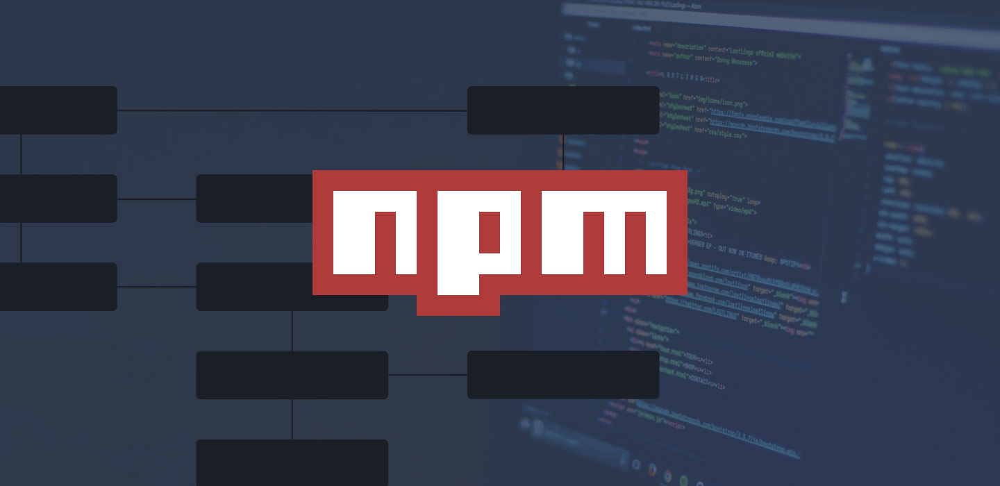

# Step 1: Install npm



In this step, we will install `npm` (Node Package Manager) to manage Node.js dependencies.

First, update your package index:

```plain
sudo apt update
```{{exec}}

- **`sudo apt update`**: Updates the package index on your system. This ensures that your system has the latest information about available packages and updates.

Next, install npm by running the following command:

```plain
sudo apt install -y npm
```{{exec}}

- **`sudo apt install -y npm`**: Installs `npm` (Node Package Manager) on your system. The `-y` flag automatically confirms the installation, so you don't have to manually approve it.

Verify the installation by checking the npm version:

```plain
npm -v
```{{exec}}

- **`npm -v`**: Verifies the installation of `npm` by displaying the installed version number. This ensures that `npm` is installed correctly and ready to use.

With `npm` installed, you're now ready to manage Node.js dependencies for your projects. Let's proceed to set up a new Node.js project.