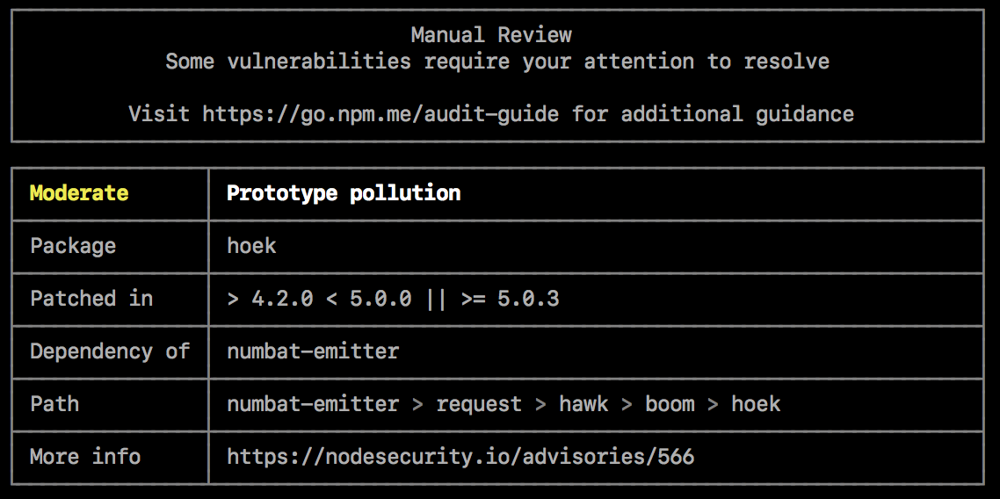

# Step 3: Run npm audit for Basic Vulnerability Detection



In this step, you will learn how to use `npm audit` to detect vulnerabilities in your project dependencies.

Run the audit to check for vulnerabilities:

```plain
npm audit
```{{exec}}

- **`npm audit`**: Runs a security audit on your project’s dependencies. It checks for known vulnerabilities in the installed packages and generates a report with the severity of the issues, paths to the vulnerable packages, and recommendations for resolving them.

Examine the audit results. You will see a list of any vulnerabilities found and recommended steps for addressing them.

**Important**: Do **not** update the dependencies and fix these issues. We will display them with Snyk in the next step.