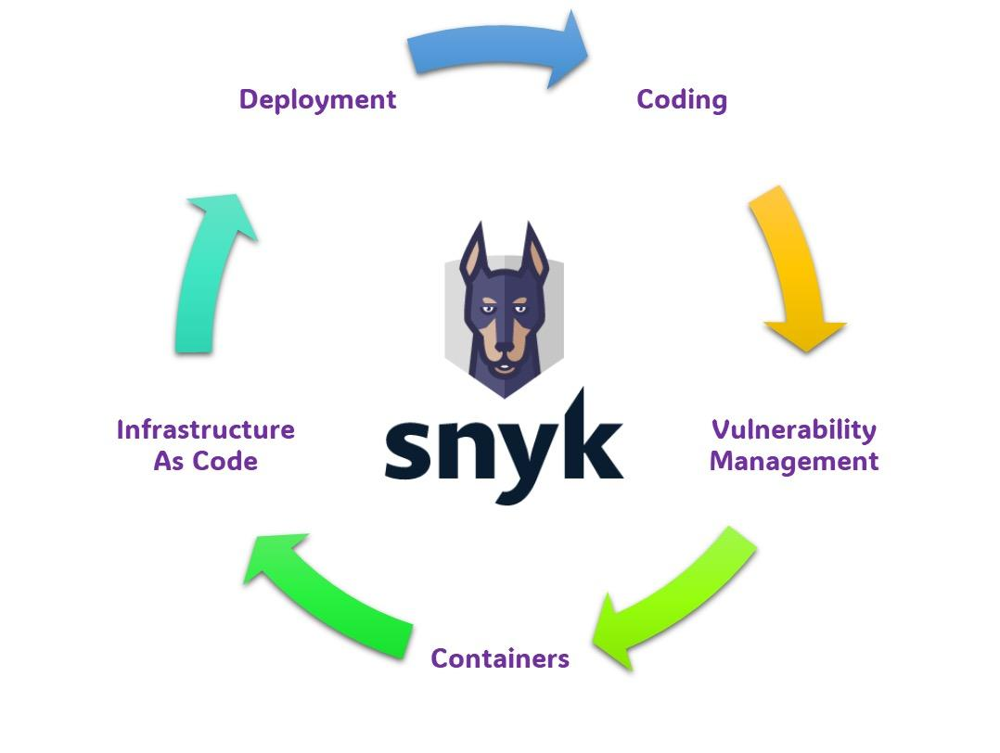
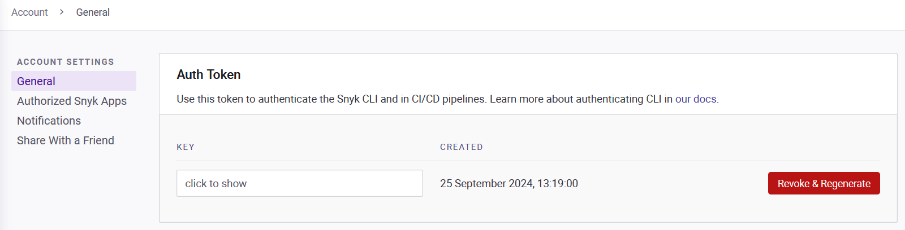
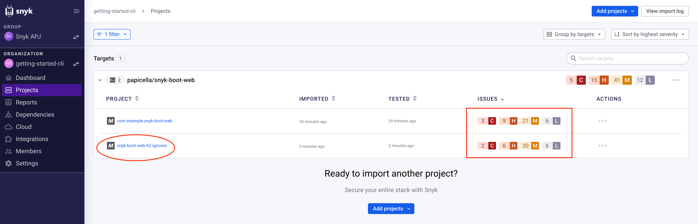
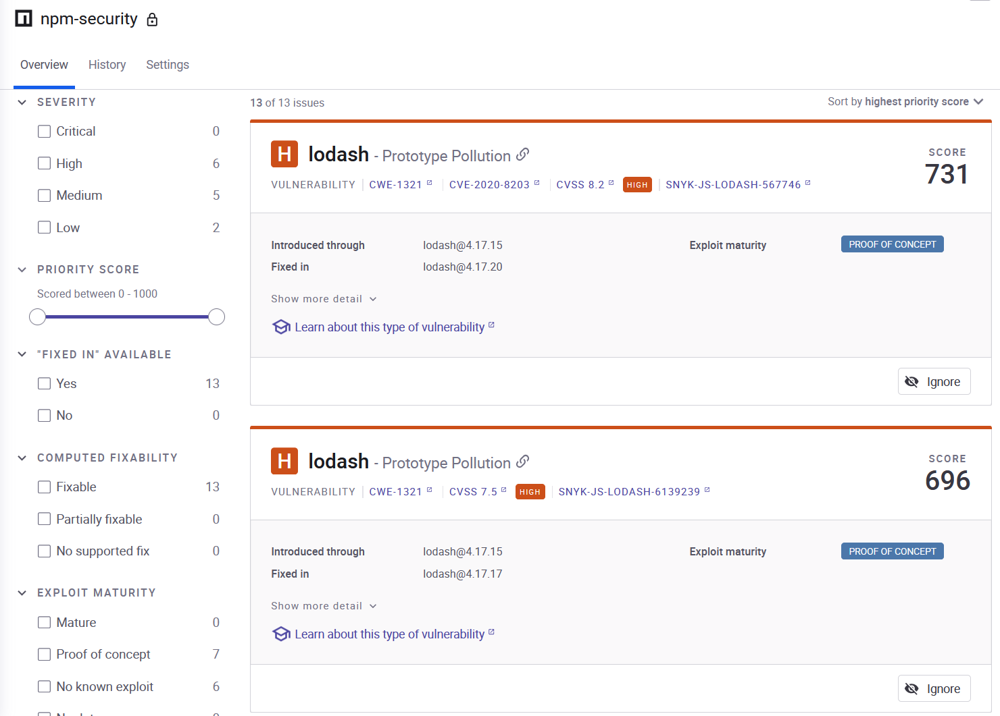

# Step 4: Run Security Audits with Snyk



Now that your project is set up, let's discuss what Snyk is before we proceed to install it and run a security audit.

## What is Snyk?

Snyk is a powerful security tool that helps developers automatically find and fix vulnerabilities in their projects. It's especially useful when working with open source dependencies, containers, and infrastructure as code (IaC). With Snyk, you can integrate security into your development workflow, ensuring that security issues are detected early and addressed quickly.

Snyk integrates seamlessly with platforms like GitHub, GitLab, and Bitbucket, making it easy to add security scanning directly into your CI/CD pipeline. It provides real-time monitoring for new vulnerabilities and even helps you track and manage issues over time, keeping your projects secure.

## Why Snyk is better than npm audit

When compared with `npm audit`, Snyk offers a range of additional features that make it an ideal choice for DevOps and DevSecOps workflows:

1. **Continuous Monitoring and Notifications**: Snyk monitors your project for new vulnerabilities after the initial scan, providing proactive notifications when new issues are discovered or when fixes become available. In contrast, `npm audit` only checks for vulnerabilities at runtime and does not monitor over time.
   
2. **Support for Multiple Languages**: While `npm audit` is limited to Node.js, Snyk supports JavaScript, Python, Java, .NET, PHP, Ruby, and more, making it suitable for projects that use multiple languages and package managers.

3. **Enhanced Remediation Capabilities**: Unlike `npm audit`, which only suggests updates, Snyk can automatically apply **precision patches** that fix vulnerabilities without needing a full version upgrade. This can be crucial for maintaining dependency compatibility.

4. **Detailed Reports and Integration with CI/CD**: Snyk integrates with GitHub, GitLab, and Bitbucket, allowing you to scan every commit and pull request. It also provides in-depth reports with clear paths for remediation, while `npm audit` offers basic reports with fewer actionable recommendations.

With these capabilities, Snyk delivers a more robust solution for maintaining security throughout the development lifecycle.

Now that we understand what Snyk is, let's install it:

```plain
npm install -g snyk
```{{exec}}

- **`npm install -g snyk`**: Installs the `Snyk` security tool globally on your system. The `-g` flag ensures that Snyk can be used across all Node.js projects on your machine, allowing you to perform vulnerability scans and monitor dependencies for security issues.

**Authenticate Snyk**

You will be prompted to log in to Snyk. If you don't have an account yet, create one for free at https://app.snyk.io. You can skip this part if you do not want to create an account.

Your Auth Token can be found here: [Snyk Auth Token](https://app.snyk.io/account). Alternatively, if you prefer not to create an account, you can use the following Auth Token: `4e7ffd73-8827-48f9-80ec-d2d430371650`. Note: Without creating an account, you won't be able to access the dashboard view; however, pictures of the dashboard will be provided for reference.

 You can find the Auth Token on the [Snyk Auth Token](https://app.snyk.io/account) page.

```bash
snyk auth <Auth Token>
```

- **`snyk auth <Auth Token>`**: Authenticates your Snyk CLI with your Snyk account using the provided Auth Token.

Run a security test to find vulnerabilities:

```plain
snyk test
```{{exec}}

 **`snyk test`**: Runs a security test on your project’s dependencies using Snyk. This command scans for vulnerabilities, misconfigurations, and license issues in your installed packages and provides detailed information on how to address any problems found.

Once you’ve tested your project, Snyk also allows you to continuously monitor your project for any new vulnerabilities over time.

Run the following command to enable monitoring:

```plain
snyk monitor
```{{exec}}

- **`snyk monitor`**: Monitors your project for vulnerabilities over time by creating a snapshot of your dependencies and their current state. This command uploads your dependency information to Snyk's servers, allowing you to receive alerts about new vulnerabilities as they are discovered. It helps you keep your project secure by continuously tracking your dependencies. You can track the project on your [Snyk dashboard](https://app.snyk.io/), which will provide ongoing monitoring and alerts as soon as new issues arise. Note: To access the dashboard, you'll need to create an account and use your own Auth Token from the previous step instead of the provided sample token.

**Remeber!** Without creating an account, you won't be able to access the dashboard view; however, pictures of the dashboard will be provided for reference.





Now that we have set up Snyk to run security audits on our project, let's show how to integrate Snyk into our GitHub Actions workflow in the next step. This will allow Snyk to automate the scanning process each time changes are made in our repository.